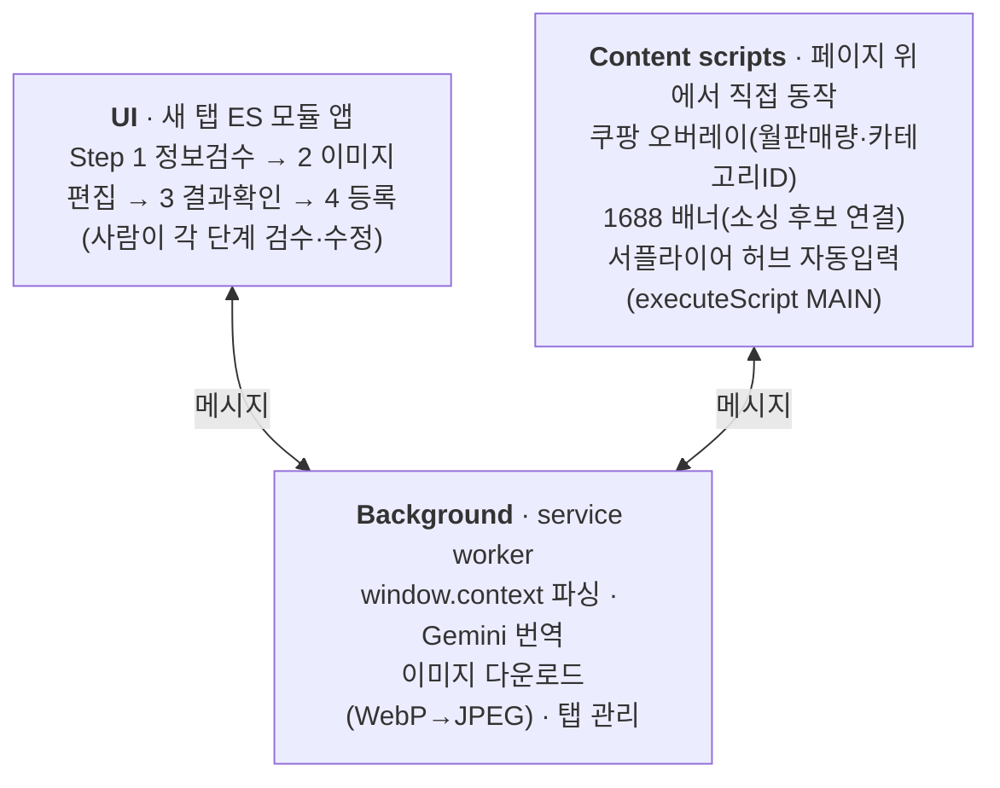
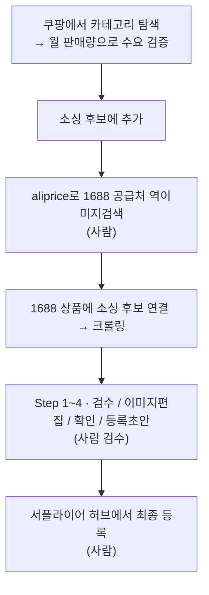

# 헤오르 자동 소싱 (autoSourcing)

> 쿠팡에서 팔릴 상품을 고르면, 1688 상품 데이터 수집부터 쿠팡 서플라이어 허브 등록 직전까지
> AI가 처리하고 **사람은 판단·검수만** 하는 Chrome 확장 프로그램(Manifest V3).

개인 브랜드(헤오르)의 해외 소싱·상품 등록 반복 업무를 반자동화하려고 만든 **내부 도구**입니다.
전 과정을 `입력 → 처리 → 출력 → 사람 검수` 파이프라인으로 구조화했고, 코드는 AI 코딩 도구(Claude Code)를
페어로 활용한 바이브 코딩으로 구현했습니다. (판단·설계·검수는 직접)

---

## 이게 뭔가요

1688(중국 도매) 상품을 쿠팡에 올리려면 **데이터 긁기 → 중국어 번역 → 마진 계산 → 상세페이지·라벨 제작 →
서플라이어 허브 폼 수십 개 필드 입력**을 매번 손으로 반복해야 합니다. 건당 수십 분, 실수 잦고, 사람이 붙어야만
확장됩니다.

이 도구는 그 반복을 이렇게 바꿉니다:

- **수집**: 1688 페이지의 `window.context` JSON을 파싱해 상품명·옵션(SKU)·가격·이미지·속성 추출
- **번역/정제**: Gemini API로 상품명·옵션·속성을 한국어로 번역 + SEO 검색태그 생성 (실패 시 Google Translate 폴백)
- **가격 계산**: 위안가 → 원가 → 공급가 → 판매가를 마진 규칙대로 자동 산출 (SKU 옵션별)
- **이미지 가공**: 상세이미지의 **중국어를 OCR로 자동 감지 → 인페인팅으로 제거** + 1:1 크롭
- **문서 생성**: 라벨·상세페이지 이미지를 HTML 템플릿에서 자동 렌더링
- **등록 준비**: 쿠팡 서플라이어 허브 Draft API로 등록 초안 자동 저장
- **원장 기록**: 등록 완료분을 Google 시트(소싱 원장)에 자동 기록

---

## 어떻게 동작하나

### 구성 (3계층)



핵심 로직이 **로그인된 브라우저 세션 안에서** 돌아가야 했기에(1688·쿠팡의 로그인 요구와 봇 차단),
독립 스크립트가 아니라 **확장 프로그램**으로 만들었습니다. 서플라이어 허브 등록은 실제 허브 탭 안에서
`executeScript(world: 'MAIN')`로 사이트 자체 Draft API를 호출합니다.

### 실제 사용 흐름 (수요 기반 소싱)



> 양 끝(공급처 발굴·최종 등록)은 사람이, 가운데(수집→가공→등록준비)는 도구가 담당하는
> **human-in-the-loop** 구조입니다. AI 결과물을 그대로 쓰지 않고 4단계로 사람이 승인·수정합니다.

소싱 후보는 두 경로로 담깁니다 — 데스크에서는 쿠팡 오버레이로, **이동 중에는 iPhone 단축어 →
Google 시트 → 확장 "가져오기"** 로.

---

## 핵심 기능 (기술적으로 재미있던 것들)

- **상세이미지 중국어 제거** — Tesseract.js OCR로 중국어를 자동 감지하고, 박스 주변 픽셀을 샘플링해
  단색/그라데이션을 판별하는 적응형 인페인팅으로 지웁니다. **외부 API 비용 0, 확장 내부 처리.**
  (MV3 CSP 제약 때문에 WASM을 로컬 번들로 로드)
- **봇 차단(Akamai 403) 우회** — 쿠팡 카테고리ID·월판매량 조회가 403으로 막히던 문제를,
  요청에 `referrer`(상품 페이지 URL) + `credentials`를 실어 통과시켰습니다.
- **다차원 SKU 처리** — 색상 × 사양 같은 2차원 옵션을 차원별로 그룹화하고, 색상 차원을 자동 판별합니다.
- **가격 정책 코드화** — `원가 = 위안가 × 400`, `공급가 = ⌈(원가+3000)/100⌉×100`,
  `판매가 = ⌈공급가/0.6/100⌉×100`(쿠팡 40% 마진). 표에서 인라인 수정도 가능.
- **동시성 안정화** — 여러 상품을 빠르게 크롤링해도 큐가 깨지지 않도록 itemId 파이프라인 정비 +
  순차 스케줄러(크롤 간 1.8초 스로틀).

이런 문제들의 발견 → 원인 진단 → 수정 → 검증 과정은 [`docs/CHANGELOG.md`](docs/CHANGELOG.md)에
날짜별로 남아 있습니다.

---

## 기술 스택

- **플랫폼**: Chrome Extension (Manifest V3) — service worker + content scripts + ES 모듈 UI
- **언어**: JavaScript (초기엔 **Python 스크립트**로 시작했다가, 브라우저 세션·봇 차단 제약으로
  확장 프로그램이 필요해지며 JS로 전면 재작성)
- **AI/API**: Gemini API(번역·정제), Tesseract.js(OCR), Google Apps Script(시트 연동)
- **라이브러리**: html2canvas(이미지 렌더), JSZip(ZIP/XLSX 파싱) — CDN 불가라 로컬 번들
- **저장소**: IndexedDB(이미지), chrome.storage(설정·후보)

---

## 프로젝트 구조

```
extension/
  manifest.json
  background/service-worker.js   # 크롤링 본체(window.context 파싱·번역·이미지)
  content_scripts/               # 쿠팡 오버레이 / 1688 배너
  ui/
    index.html · index.js        # 새 탭 UI 진입점
    modules/                     # 기능별 ES 모듈 (가격계산·OCR·인페인팅·Step 1~4 등)
    static/                      # 라벨·상세페이지 HTML 템플릿
docs/                            # 설계·변경이력·모듈 지도 (아래)
```

- 프로젝트 개요·비즈니스 로직: [`CLAUDE.md`](CLAUDE.md)
- 모듈 지도(어디에 뭐가 있는지): [`docs/MODULES.md`](docs/MODULES.md)
- 변경 이력(문제→수정 로그): [`docs/CHANGELOG.md`](docs/CHANGELOG.md)

---

## 정직한 한계

- 1688 `window.context` JSON 구조가 바뀌면 파싱이 깨질 수 있습니다(파싱 로직 수정으로 대응).
- 쿠팡 카테고리 자동 선택이 어려워 사람이 수동 확인해야 하는 경우가 있습니다.
- **1688 공급처 발굴 자체는 도구가 하지 않습니다** — 사람이 aliprice 역이미지검색으로 찾습니다.
- 쿠팡·1688의 UI/봇 차단 정책이 바뀌면 오버레이 셀렉터·우회 로직이 깨질 수 있습니다.

---

## 개발 메모

개인 브랜드 운영 효율화를 위한 내부 도구이며, 문제 정의·설계·기술 선택·검수는 직접 하고
구현은 AI 코딩 도구(Claude Code)를 페어로 활용했습니다. 진행 상태는 [`docs/SESSION.md`](docs/SESSION.md) 참고.
